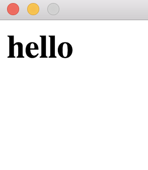

# HCV
> HTML CSS View.  
> A simple tool for creating windows and popup messages using HTML and CSS.

## Usage
> To create a Window:

    $ hcv <width> <height> <html>

> For example:

    $ hcv 150 150 "<h1>Hello</h1>"

> This will create a window looking like this:

## Installing
> The requirements are:

* Qt5
* a C++ compiler (g++ for example)

### Linux
> Run this script to install on Linux:

    $ ./install.sh

### OSX
> Run this script to install on OSX:

    $ ./install-osx.sh
